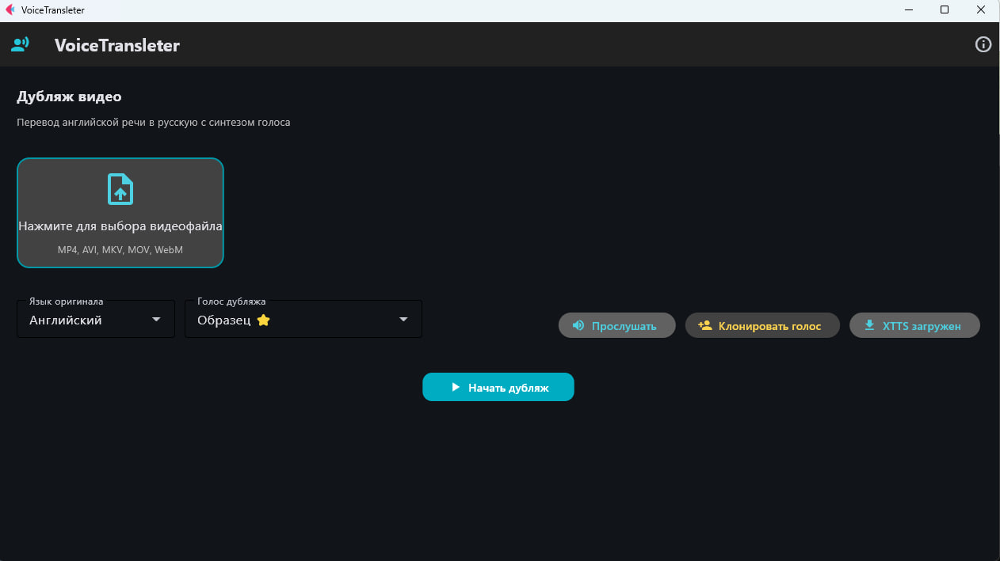

# VoiceTransleter



Дубляж видео с переводом речи на русский язык с синтезом голоса (любой язык → RU).

**Версия:** 1.1

**Разработчик:** Андраник Алавердян (AndranikFutureLabs)  
**Поддержка:** [@AndranikFutureLabs](https://t.me/AndranikFutureLabs)  
**Канал разработчика:** [@AndranikFutureLabsChannel](https://t.me/AndranikFutureLabsChannel)  
**Сайт:** https://andranik-future-labs.ru  
**GitHub:** https://github.com/AndranikFutureLabs/VoiceTransleter

---

## Что нового в версии 1.1

- **Перевод с любого языка** — теперь поддерживается дубляж видео не только с английского, но и с других языков (автоопределение языка оригинала)
- **Исправлено произношение цифр в дубляже** — числа, разделённые точкой, произносятся как отдельные цифры без озвучивания точки:  
  `GLA 5.2` → произносится «GLA пять два»  
  `Платформа 8.3.27.1678` → произносится «Платформа восемь три двадцать семь шестнадцать семьдесят восемь»
- **Обновлён интерфейс** — кликабельные ссылки, информация о канале разработчика

---

## Установка

### Требования

- Python 3.10+
- FFmpeg (в PATH или в папке `ffmpeg/`)
- 8+ ГБ ОЗУ (рекомендуется 16 ГБ для XTTS)

### Инструкция

1. **Клонирование репозитория:**

```bash
git clone https://github.com/AndranikFutureLabs/VoiceTransleter.git
cd VoiceTransleter
```

2. **Создание виртуального окружения (рекомендуется):**

```bash
python -m venv venv
# Windows:
venv\Scripts\activate
# Linux/Mac:
# source venv/bin/activate
```

3. **Установка зависимостей:**

```bash
pip install -r requirements.txt
```

4. **Установка FFmpeg:**

Скачайте FFmpeg с https://ffmpeg.org/download.html и поместите `ffmpeg.exe`, `ffprobe.exe` в папку `ffmpeg/` в корне проекта, либо добавьте в системную переменную PATH.

5. **Подготовка образца голоса для дубляжа (для XTTS):**

Поместите аудиообразец голоса в папку `voices/` с именем `Образец.wav` (поддерживаются также .mp3, .m4a, .ogg).

Пример:
```
C:\VoiceTransleter\voices\Образец.wav
```

Рекомендации по образцу:
- Формат: WAV (предпочтительно) или MP3
- Длительность: 5–15 секунд
- Чистая речь без фонового шума

6. **Запуск:**

```bash
python main.py
```

---

## Использование

1. Запустите программу: `python main.py`
2. Нажмите на область загрузки и выберите видеофайл (MP4, AVI, MKV, MOV, WebM)
3. Выберите язык оригинала (по умолчанию Английский)
4. Выберите голос дубляжа:
   - **Silero** — встроенные голоса, работают без загрузки
   - **XTTS** — качественный синтез, требуется загрузка модели (~1.87 ГБ) и образец голоса
5. Нажмите **«Начать дубляж»**
6. Дождитесь завершения обработки (прогресс отображается в логе)
7. После завершения откроется карточка с результатом — можно открыть видео или папку

### Результаты

После обработки в папке `output/` создаются:
- `*_dubbed.mp4` — готовое видео с дубляжом
- `*_source.txt` — исходный текст с таймингами
- `*_source_plain.txt` — исходный текст без таймингов
- `*_translation.txt` — перевод с таймингами
- `*_translation_plain.txt` — перевод без таймингов
- `*_source_translit.txt` — транслитерация оригинала (En→Ru) с таймингами
- `*_source_translit_plain.txt` — транслитерация оригинала без таймингов
- `*_translation_translit.txt` — транслитерация перевода (Ru→La) с таймингами
- `*_translation_translit_plain.txt` — транслитерация перевода без таймингов

### Клонирование голоса

1. Нажмите **«Клонировать голос»**
2. Выберите аудиообразец (3–10 секунд, чистый голос)
3. Введите название голоса
4. Нажмите **«Клонировать»**

---

## Структура проекта

```
VoiceTransleter/
├── main.py                  # Графический интерфейс
├── config.py                # Конфигурация
├── requirements.txt         # Зависимости
├── ffmpeg/                  # FFmpeg (скачать отдельно)
├── voice_transleter/        # Основной модуль
│   ├── pipeline.py          # Пайплайн обработки
│   ├── audio_extractor.py   # Извлечение аудио
│   ├── transcription.py     # Транскрибация (Whisper)
│   ├── translator.py        # Перевод
│   ├── tts.py               # Синтез речи (Silero / XTTS)
│   ├── video_renderer.py    # Сборка видео
│   └── voice_cloner.py      # Клонирование голоса
├── voices/                  # Образцы голосов
├── models/                  # Скачанные модели
├── temp/                    # Временные файлы
└── output/                  # Результаты
```

---

## Технологии

- **Whisper** (faster-whisper) — распознавание речи
- **Google Translate / LibreTranslate** — перевод
- **Silero TTS / XTTS v2** — синтез речи
- **FFmpeg** — обработка аудио/видео
- **Flet** — графический интерфейс
